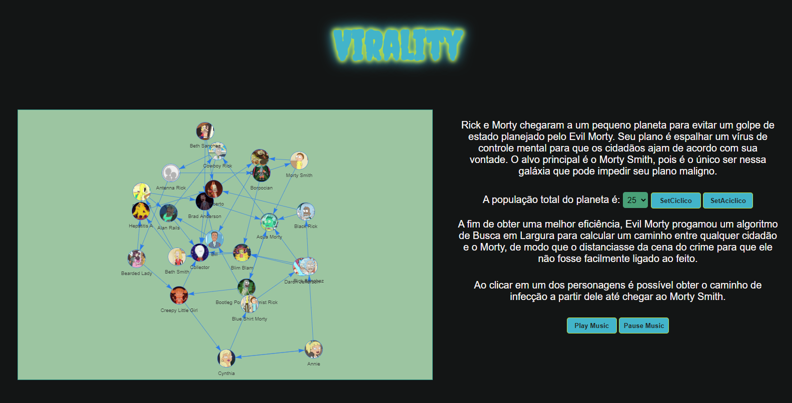
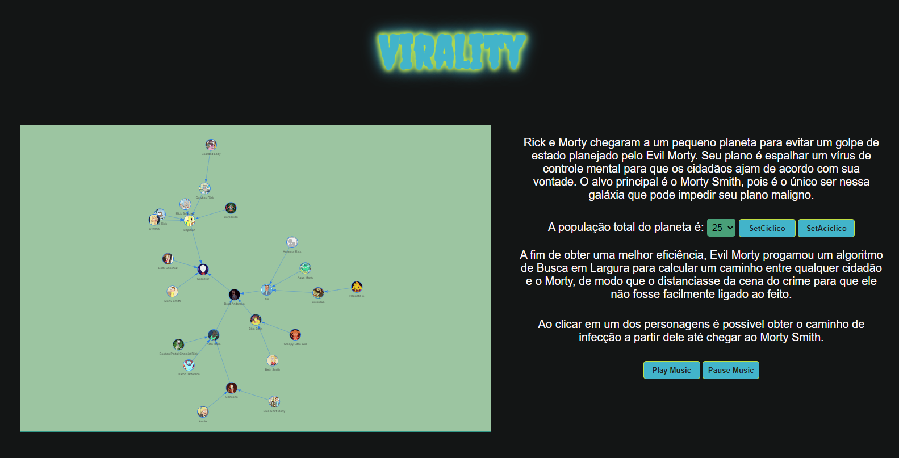
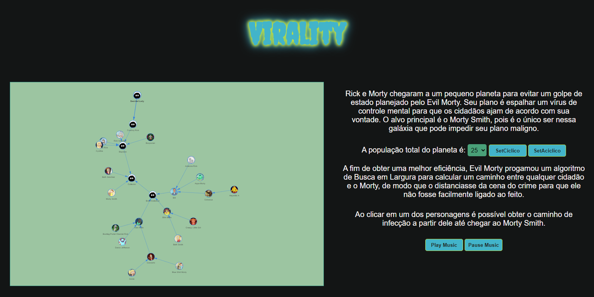

# Virality

**Número da Lista**: 1 
**Conteúdo da Disciplina**: Grafos 1 

## Alunos
|Matrícula | Aluno |
| -- | -- |
| 16/0124581  |  Hugo Aragão de Oliveira |
| 20/2015984  |  Breno Henrique de Souza |

## Sobre 

Virality é uma aplicação web simples que visa demonstrar de forma lúdica a execução
de um algoritmo de Busca em Largura de forma interativa, onde o usuário pode
interagir com o grafo como se fosse um personagem da animação Rick & Morty.

## Screenshots
Grafo ciclico gerado:

Grafo aciclico gerado:

Exemplo de grafo aciclico com infecção:

## Instalação 
**Linguagem**: Javascript 
**Framework**: Não foi utilizado  

Para rodar o projeto é necessário ter acesso a internet para clonar o repositório, e ter um navegador instalado no computador(de preferência chrome ou edge), para rodar o projeto localmente.

## Uso 
Acesse o link do [Virality](https://grafos1-virality.vercel.app/) para interagir com
o site.

Ou

Clone o repositório e execute o server utilizando a extensão [Live Server](https://marketplace.visualstudio.com/items?itemName=ritwickdey.LiveServer) no seu VsCode. A
porta local é informada pela própria extensão quando executado.

Também é possível executar diretamente em seu navegador (caso tenha o projeto clonado em sua máquina), apenas copiando o path do arquivo `index.html`.

## Outros 
Se quiser ouvir a música temática enquanto testa é só dar o Play Music.

